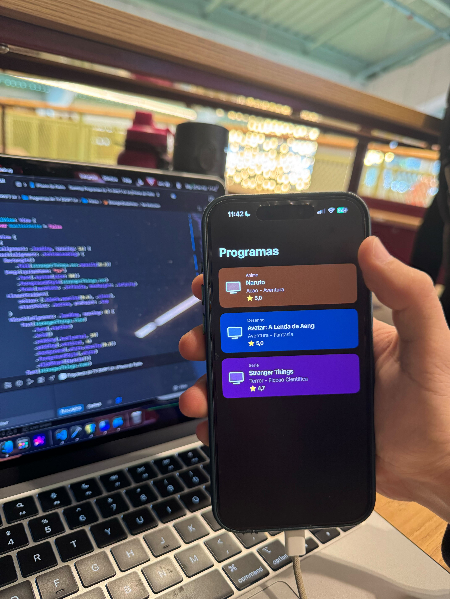
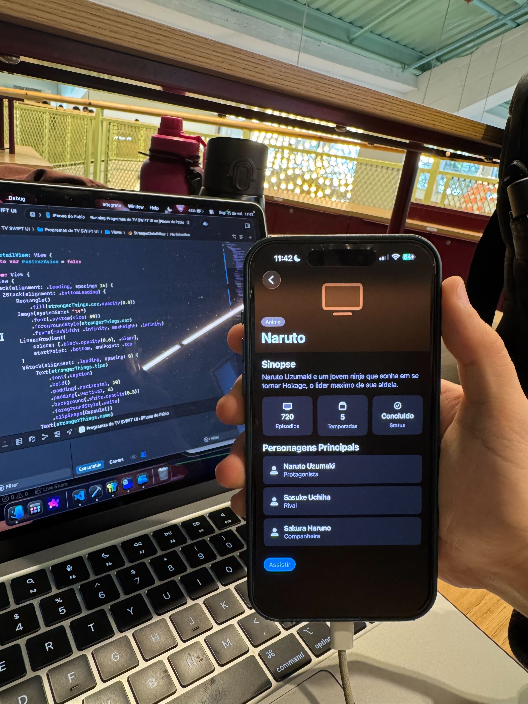
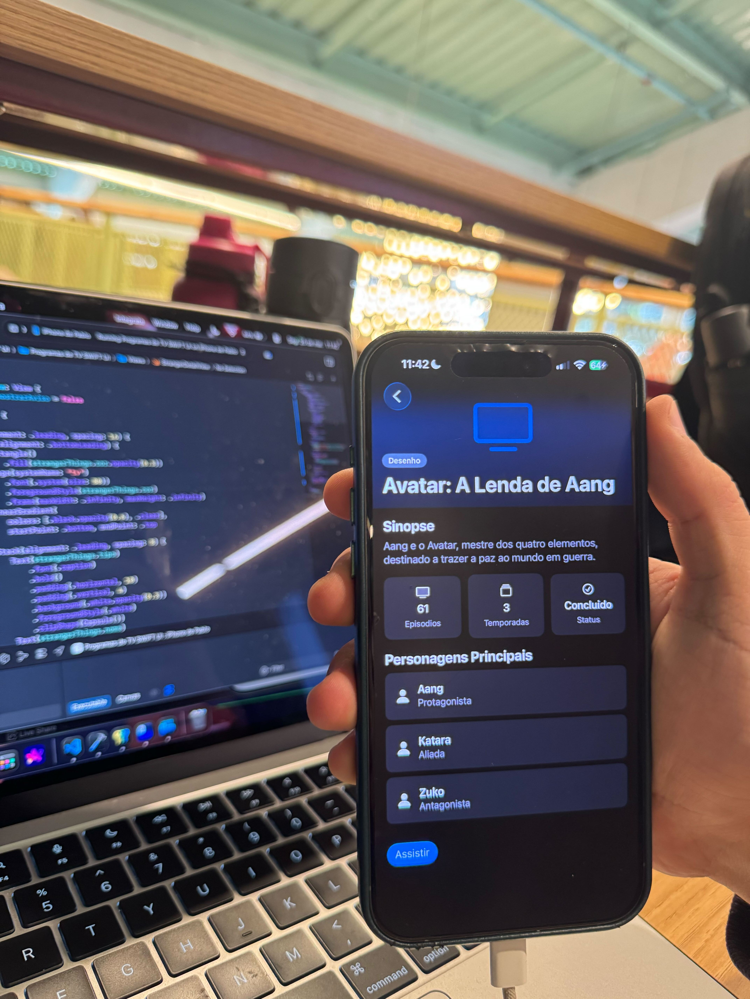
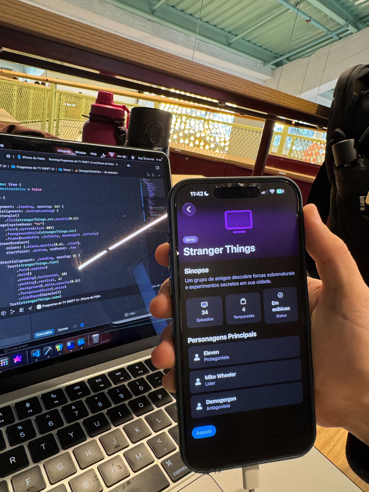

# Relatório de Atividade — SwiftUI: Programas de TV
**Alunos:** Cecília Galvão e Pablo Azevedo
**Disciplina:** Programação — Prof. Murilo Zanini
**Data:** 25 de maio de 2025

## Introdução

Esta atividade foi proposta pelo professor Murilo Zanini em aula, no módulo de iOS. O ponto de partida era construir do zero um app em SwiftUI que exibisse uma lista de programas de TV, Naruto, Avatar e Stranger Things, com navegação para uma tela de detalhe contendo sinopse, informações gerais, personagens e um botão "Assistir".

Este relatório não é uma lista de passos certos. É um registro honesto de tudo que tentamos, erramos, entendemos errado e eventualmente acertamos, porque acreditamos que isso representa melhor o que de fato aprendemos do que uma solução apresentada já pronta e polida.

A maior parte das descobertas saiu do **[Plano de Estudos SwiftUI da Firelink](https://firelink-library.github.io/mobile/swift/plano-estudos/)**, e os exercícios relevantes são citados ao longo do relatório.

---

## A jornada (com os erros de verdade)

### Passo 0 — dificuldades antes de rodar o projeto

A primeira tentativa foi montar o repositório **direto pelo terminal**, criando os arquivos `.swift` manualmente e tentando buildar. O build falhou sem uma mensagem de erro clara. Depois de pesquisar, ficou evidente que um app iOS precisa do esqueleto gerado pelo Xcode (`.xcodeproj`, target, signing, `Info.plist`...). O projeto foi recriado corretamente pelo Xcode.

Em seguida, o app não subia no simulador por incompatibilidade de versão do iOS no deployment target. O Pablo tentou ajustar o número manualmente no arquivo de build, mas a Cecília identificou que a configuração correta ficava no target do projeto dentro do próprio Xcode. Após o ajuste, o build funcionou.

> Aprendizado: projeto iOS nasce no Xcode, e a versão do iOS é a primeira coisa a conferir.

### Passo 1 — a navegação que não funcionava

O comportamento esperado era que clicar no card de um programa abrisse a tela de detalhe correspondente. Por um tempo considerável, o clique não produzia nenhuma resposta visível. A Cecília suspeitou que o problema estava no `Button` e testou o `.onTapGesture` no lugar, sem resultado.

O problema só foi identificado **a partir do repositório de exemplo disponibilizado pelo professor**. Analisando o exemplo, ficou claro que faltava envolver o card em um `NavigationLink` dentro de um `NavigationStack`, não era o `Button` nem a view de destino, era a ausência do mecanismo de navegação em si. Antes, o `ShowCard` estava solto:

```swift
// não navegava
VStack(spacing: 16) {
    ShowCard(programa: naruto)
}
```

Depois do exemplo:

```swift
// agora abre a tela
NavigationLink {
    ProgramaDetailView(programa: programa)
} label: {
    ShowCard(programa: programa)
}
.buttonStyle(.plain)   // para não aplicar o estilo azul padrão de link
```

### Fase 1 — estrutura inicial e o problema de identação

Essa fase envolveu estruturar as pastas (`Models`, `Views`, `Components`), criar o modelo `Programa` e montar as primeiras telas. O principal obstáculo foi a **identação**. SwiftUI aninha muitas camadas de views (`ScrollView { VStack { ZStack { ... } } }`), e quando os `{ }` ficam desalinhados torna-se difícil saber onde uma view termina e a outra começa. Erros de `"expected '}'"` apareceram repetidamente por esse motivo.

O Pablo tentou resolver adicionando chaves no final do arquivo, o que só introduziu novos erros. A partir daí adotamos o hábito de alinhar os blocos com cuidado antes de compilar.

A base de stacks veio do exercício **#2 (VStack, HStack, ZStack)** da Firelink, que demonstra o padrão de aninhar uma `VStack` dentro de um `ZStack` com fundo, estrutura usada diretamente no hero da tela de detalhe.

### Fase 2 / 3 — o card e os problemas de padding

Essa foi a fase mais trabalhosa. O fundo colorido do card não cobria a área esperada:

```swift
// resultado incorreto
Text(programa.nome)
    .background(programa.cor)
    .padding()
```

A Cecília achou que era um problema do simulador e sugeriu reiniciá-lo. O Pablo desconfiou da ordem dos modificadores e foi pesquisar. No exercício **#5 (Modificadores Essenciais)** da Firelink encontramos a explicação:

> *"A ORDEM importa: `Text('A').padding().background(.blue)` cria padding colorido; `Text('A').background(.blue).padding()` cria padding transparente."*

**A ordem dos modificadores altera o resultado.** Para que a cor cubra o espaço do padding, o `.padding()` precisa ser aplicado antes do `.background()`. A versão corrigida:

```swift
// resultado correto
HStack(spacing: 12) {
    ...
}
.padding()
.frame(maxWidth: .infinity, alignment: .leading)
.background(programa.cor.opacity(0.25))   // cor aplicada após o padding
.cornerRadius(16)
```

Outras descobertas desta fase:

- **Substituição de emoji por ícone:** a thumbnail usava emoji inicialmente, o que dificultava o alinhamento. O exercício **#3 (Imagens e SF Symbols)** apresentou o `Image(systemName:)` com ícones do sistema como `tv`, `person.fill` e `star.fill` — mais simples e sem necessidade de assets externos.

- **Hero com gradiente:** para manter o nome legível sobre a cor de fundo, foi usado um `LinearGradient` com `.ignoresSafeArea()`, conforme o exercício **#6 (Cores e Gradientes)**. O mesmo exercício indicou o uso de `.foregroundStyle` em vez de `.foregroundColor`, mais adequado para iOS 17+.

- **Botão "Assistir":** implementado com base no exercício **#4 (Botões e Ações)**, usando `Button` com closure e `.buttonStyle(.borderedProminent)`, conectado a um `.alert` que exibe "Em construção" ao ser acionado.

### Fase final — tela reutilizável e erros de build

O objetivo desta fase era substituir as telas separadas por uma única `ProgramaDetailView(programa:)` reutilizável e construir a lista com `ScrollView` + `ForEach` sobre um array de programas.

Ao integrar o código, surgiram vários erros de build. O mais relevante foi no `ForEach`: o Xcode apontou que `Programa` não conformava o protocolo `Identifiable`. A Cecília sugeriu adicionar um campo `id` à struct. O Pablo encontrou uma alternativa que dispensava alterar o modelo — passar um keypath explícito:

```swift
ForEach(programas, id: \.nome) { programa in
    NavigationLink {
        ProgramaDetailView(programa: programa)
    } label: {
        ShowCard(programa: programa)
    }
    .buttonStyle(.plain)
}
```

Os demais erros foram resolvidos de forma direta, pois o Xcode aponta linha e motivo, bastou ler e corrigir cada um.

---

## Como ficou a estrutura

```
Programas de TV SWIFT UI/
├── Programas_de_TV_SWIFT_UIApp.swift   # entrada do app
├── Models/
│   ├── Programa.swift                  # modelo + dados
│   └── Programa+Cor.swift              # cor por tipo (extensão)
└── Views/
    ├── ListaView.swift                 # Tela 1 (ForEach sobre o array)
    ├── ProgramaDetailView.swift        # tela de detalhe reutilizável
    └── Components/
        ├── ShowCard.swift              # card da lista
        ├── InfoBadge.swift             # badge de info do detalhe
        └── CharacterRow.swift          # linha de personagem
```

## Capturas de tela

**Imagem 1 — Lista de programas**



**Imagem 2 — Detalhe: Naruto**



**Imagem 3 — Detalhe: Avatar**



**Imagem 4 — Detalhe: Stranger Things**



## Como rodar

1. Abrir o `.xcodeproj` no Xcode.
2. Conectar o iPhone ou selecionar um simulador.
3. Em **Signing & Capabilities**, marcar *Automatically manage signing* e selecionar o Team.
4. Pressionar ▶️.

## Referências (e o que cada uma resolveu)

Trilha base: **[Plano de Estudos SwiftUI — Firelink](https://firelink-library.github.io/mobile/swift/plano-estudos/)**.

| Exercício | O que resolveu no projeto |
|-----------|---------------------------|
| #1 Hello, SwiftUI! | Noção de que tudo é `View` e que modificadores são encadeados. |
| #2 VStack, HStack, ZStack | Base do card e do hero (ZStack de fundo + VStack por cima). |
| #3 Imagens e SF Symbols | Substituição de emoji por `Image(systemName:)` (`tv`, `person.fill`, `star.fill`). |
| #4 Botões e Ações | `Button` + closure e `.buttonStyle(.borderedProminent)` no "Assistir". |
| #5 Modificadores Essenciais | **A ordem importa**, resolveu o erro do `padding` vs `background`. |
| #6 Cores e Gradientes | `LinearGradient` + `.ignoresSafeArea()` no hero e uso de `.foregroundStyle`. |

E o **repositório de exemplo do professor**, que destravou a navegação entre telas (`NavigationLink` + `NavigationStack`).

## Resumo dos aprendizados

- Projeto iOS nasce no Xcode, não é possível montar apenas pelo terminal.
- Verificar a versão do iOS / deployment target logo no início evita problemas de compatibilidade.
- Identação é crítica em SwiftUI pelo aninhamento profundo de views.
- **A ordem dos modificadores altera o resultado**, padding antes de background para a cor cobrir a área correta.
- Ajustar um componente por completo antes de replicar poupa tempo e confusão.
- `ForEach` com struct requer `id:` se ela não for `Identifiable`.
- Erros de build no Xcode apontam linha e motivo, ler a mensagem é o primeiro passo para a correção.

## O que tentamos e não conseguimos entregar

A ideia era usar imagens geradas por IA da Cecília e do Pablo representando cada programa, uma versão estilizada do pôster de Naruto, Avatar e Stranger Things com a nossa identidade visual, como thumbnail nos cards e no hero da tela de detalhe, no lugar do ícone genérico `tv` do SF Symbols.

Geramos as imagens sem dificuldade, mas a integração com o projeto travou em dois pontos. Primeiro, não conseguimos configurar corretamente o catálogo de assets do Xcode para aceitar as imagens, o `Image("nome")` não encontrava os arquivos e retornava uma view vazia sem nenhuma mensagem de erro útil. Segundo, ao pesquisar sobre redimensionamento e recorte das imagens dentro do SwiftUI, percebemos que precisaríamos lidar com `.resizable()`, `.scaledToFill()` e `clipped()` em conjunto, e o resultado ficou distorcido nas nossas tentativas. Optamos por não entregar algo visualmente quebrado e mantivemos o SF Symbol como placeholder.

Fica como próximo passo: entender o fluxo correto de importação de imagens no Xcode e o comportamento dos modificadores de redimensionamento no SwiftUI.

## Conclusão

A atividade proposta pelo professor Murilo Zanini rendeu muito mais do que esperávamos ao abrir o projeto pela primeira vez. Antes de escrever qualquer linha de SwiftUI, já havia aprendizado: entender que projetos iOS precisam do Xcode, que o deployment target é a primeira configuração a verificar e que a navegação entre telas depende de uma estrutura específica que não é óbvia sem um exemplo concreto.

Os erros ao longo do processo, a ordem dos modificadores, a identação profunda do SwiftUI, o protocolo `Identifiable` no `ForEach`, foram mais instrutivos do que qualquer passo que funcionou de imediato. Cada um deles exigiu entender o motivo, não apenas aplicar a correção. O que tentamos e não conseguimos entregar, como as imagens geradas por IA, também fez parte do aprendizado: identificar onde o conhecimento ainda é insuficiente é tão útil quanto resolver o que está na frente.